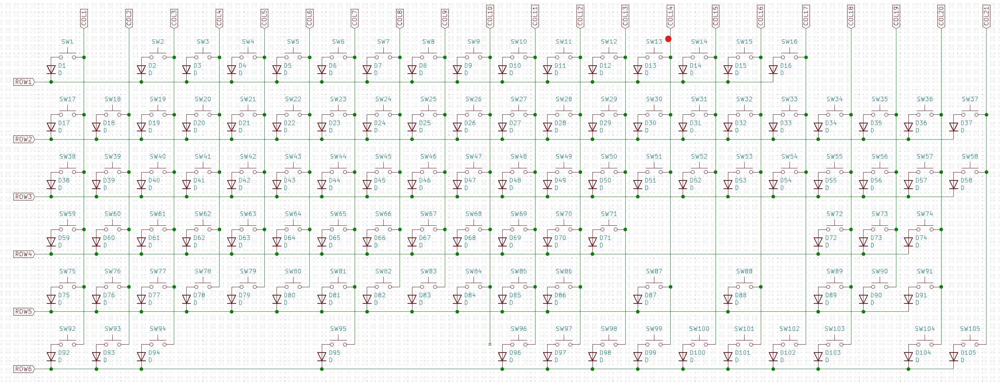

# Custom Keyboard PCB (WIP)

### by Alexander Mandera

## ToDo

- Check if USB traces are alright
- Add holes for 3d printed case

# Layout

[Permalink to keyboard-layout-editor.com](http://www.keyboard-layout-editor.com/##@@=Esc&_x:1%3B&=F1&=F2&=F3&=F4&_x:0.5%3B&=F5&=F6&=F7&=F8&_x:0.5%3B&=F9&=F10&=F11&=F12&_x:0.25%3B&=PrtSc&=Scroll%20Lock&=Pause%0ABreak%3B&@_y:0.5%3B&=%C2%B0%0A%5E&=!%0A1&=%22%0A2&=%C2%A7%0A3&=$%0A4&=%25%0A5&=%2F&%0A6&=%2F%2F%0A7&=(%0A8&=)%0A9&=%2F=%0A0&=%3F%0A%C3%9F&=%60%0A%C2%B4&_w:2%3B&=Backspace&_x:0.25%3B&=Insert&=Home&=PgUp&_x:0.25%3B&=Num%20Lock&=%2F%2F&=*&=-%3B&@_w:1.5%3B&=Tab&=Q&=W&=E&=R&=T&=Z&=U&=I&=O&=P&=%C3%9C&=*%0A+&_x:0.25&w:1.25&h:2&w2:1.5&h2:1&x2:-0.25%3B&=Enter&_x:0.25%3B&=Delete&=End&=PgDn&_x:0.25%3B&=7%0AHome&=8%0A%E2%86%91&=9%0APgUp&_h:2%3B&=+%3B&@_w:1.75%3B&=Caps%20Lock&=A&=S&=D&=F&=G&=H&=J&=K&=L&=%C3%96&=%C3%84&='%0A%23&_x:4.75%3B&=4%0A%E2%86%90&=5&=6%0A%E2%86%92%3B&@_w:1.25%3B&=Shift&=%3E%0A%3C&=Y&=X&=C&=V&=B&=N&=M&=%2F%3B%0A,&=%2F:%0A.&=%2F_%0A-&_w:2.75%3B&=Shift&_x:1.25%3B&=%E2%86%91&_x:1.25%3B&=1%0AEnd&=2%0A%E2%86%93&=3%0APgDn&_h:2%3B&=Enter%3B&@_w:1.25%3B&=Ctrl&_w:1.25%3B&=Win&_w:1.25%3B&=Alt&_a:7&w:6.25%3B&=&_a:4&w:1.25%3B&=AltGr&_w:1.25%3B&=Win&_w:1.25%3B&=Menu&_w:1.25%3B&=Ctrl&_x:0.25%3B&=%E2%86%90&=%E2%86%93&=%E2%86%92&_x:0.25&w:2%3B&=0%0AIns&=.%0ADel)

# PCB

#### Schematic

#### Matrix

#### PCB (Routing)

### PCB (Render)

